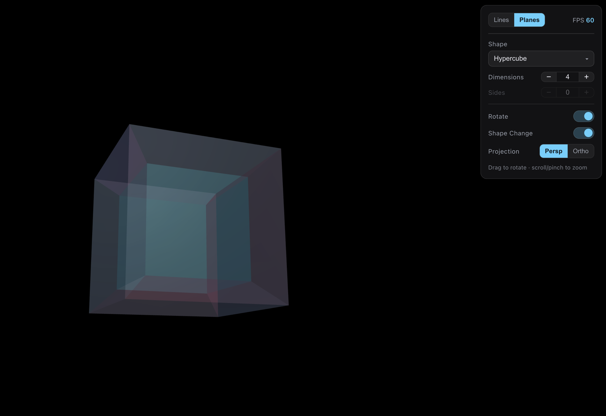

# Multi-Dimensional Shape Visualizer

An interactive visualizer for shapes in 1 to 8 dimensions, built with
Three.js. Polytopes, tori, prisms and spheres tumble through their
higher-dimensional rotation planes and project down into 3D, so you can see
what the 4th dimension (and past it) actually looks like.



## What you need

Any modern browser with WebGL: Chrome, Firefox, Safari, Edge, and Chromebooks
are all fine. It runs entirely in the browser, collects no data, needs no
account, and a built copy works offline.

## Run it

**Hosted.** Live at [nplanes.fun](https://nplanes.fun). The included GitHub
Actions workflow publishes the app to GitHub Pages every time you push to
`main`. Turn it on once under Settings > Pages > Source: "GitHub Actions".
The `public/CNAME` file points Pages at the custom domain; without it (e.g.
a fork), it goes live at `https://<your-username>.github.io/multi-dim-viz/`
instead. Nothing to install.

**Locally** (needs [Node.js](https://nodejs.org) 20.19 or newer):

```bash
npm install
npm run dev
```

Then open the URL Vite prints (usually http://127.0.0.1:5173/).

`npm run build` gives you a self-contained bundle in `dist/` that any static
host can serve, including from a subdirectory. If you host a copy, keep
`THIRD-PARTY-NOTICES.txt` next to it. That is the Three.js license notice.

## Controls (top-right panel)

| Control            | What it does                                                                                                                                                                                                          |
| ------------------ | --------------------------------------------------------------------------------------------------------------------------------------------------------------------------------------------------------------------- |
| **Lines / Planes** | View mode toggle.                                                                                                                                                                                                     |
| **FPS**            | Live framerate (render is capped at 60).                                                                                                                                                                              |
| **Shape**          | Hypercube, Simplex, Cross-Polytope, Torus, Möbius Strip, N-gon Prism, Sphere.                                                                                                                                         |
| **Dimensions**     | -/+ steppers, range per shape (see below). Updates live.                                                                                                                                                              |
| **Sides**          | -/+ steppers, range per shape. Disabled when the side count is fixed or does not apply.                                                                                                                               |
| **Rotate**         | Toggles rigid rotation in ordinary visible space.                                                                                                                                                                     |
| **Shape Change**   | Toggles the higher-dimensional morph: rotations through the hidden axes plus a depth pulse. Off at 3 dimensions or below (nothing hidden to morph). Turning it off puts the shape back to its plain, undeformed view. |
| **Projection**     | Perspective (the nested, telescoping look) vs Orthographic (flat and parallel).                                                                                                                                       |

- **Drag** (mouse or touch) to rotate the view. Dragging turns Rotate off. If
  you fling it fast while Rotate is off, it hands motion back to auto-rotate
  when you let go.
- **Scroll or pinch** to zoom.

### Per-shape parameter ranges

Each shape only lets you pick the values that mean something for it, so the
steppers re-range (and re-clamp the current value) when you switch shapes.

| Shape                                | Dimensions | Sides     | Why                                                                                |
| ------------------------------------ | ---------- | --------- | ---------------------------------------------------------------------------------- |
| Hypercube / Simplex / Cross-Polytope | 1-8        | n/a       | meaningful at every dimension, including the 1D segment                            |
| Torus                                | 2-8        | 2 (fixed) | 2D is the ring; 3D and up is the donut surface, coiling into each higher dimension |
| Möbius Strip                         | 3 (fixed)  | 1 (fixed) | the one-sided strip needs 3D for its half-twist                                    |
| N-gon Prism                          | 2-8        | 3-12      | the cross-section polygon needs at least 3 sides                                   |
| Sphere                               | 2-8        | 2 (fixed) | a 2-sphere surface that coils into each higher dimension (see the note below)      |

**About the curved shapes.** The torus, sphere and Möbius strip are 2D
surfaces. At higher dimensions the app does not build a true n-torus or
n-sphere, because sampling those densely enough would blow up the mesh.
Instead it takes the familiar surface and coils it into each extra axis with
its own winding, so every dimension step really does change the shape while
staying cheap to draw. The polytopes (hypercube, simplex, cross-polytope) and
the prism are exact n-dimensional constructions.

## View modes

- **Lines** draws the shape's edges. Each edge is colored by the dimension it
  runs along the most: dimensions 1-3 share one color (cyan) and dimensions
  4-8 each get their own bright hue, so you can tell at a glance which
  dimension an edge belongs to. (In the code the axes are 0-based, so axes 0-2
  share the base color.)
- **Planes** draws the shape's 2D faces as semi-transparent, double-sided lit
  surfaces, colored the same way as the edges (each face takes the color of
  its dominant dimension). One external light plays across the faces as the
  shape morphs. Lighting an N-dimensional projection is hand-wavy by nature.
  It is just there to make the structure readable.

## How it works

Each frame runs the same pipeline:

1. **Generate** the shape as N-dimensional vertices, edges and faces
   (`src/geometry/shapes.js`), centered and scaled to a unit radius.
2. **Rotate** the vertices in the depth-like coordinate planes (z with a
   hidden axis, or two hidden axes) so the extra dimensions show up without
   looking like ordinary spin (`src/math/ndmath.js`). Plain visible spin is a
   separate 3D rotation.
3. **Project** from N-D down to 3D one dimension at a time. Perspective
   divides by a viewing-distance term at each step; orthographic just drops
   the extra coordinates.
4. **Render** the 3D result with Three.js, which handles the final step down
   to 2D for the screen.

A rotation in N dimensions happens in a _plane_ (a pair of axes), not around
an axis, which is why the controls talk about rotation planes. The plane
speeds do not share simple ratios, so the morph never falls into an obvious
loop.

## Development

```bash
npm run test   # geometry checks, closed-form counts, motion logic
npm run bench  # CPU-side rotate/project benchmark for the worst-case settings
npm audit      # dependency advisory check
```

CI (`.github/workflows/ci.yml`) runs the format check, tests and build on
every push, then deploys `dist/` to GitHub Pages from `main`.

`npm install` also sets up a pre-commit hook (via Husky) that runs Prettier
and the tests. Format with `npx prettier --write .`. If you add or rename
files, regenerate the repo map with `python3 scripts/generate-repo-map.py`.

### Project layout

```
src/
  main.js               integration: scene, camera, lights, loop, wiring
  geometry/shapes.js    N-D shape generation (vertices / edges / faces)
  math/ndmath.js        N-D rotation + projection
  math/motion.js        Shape Change morph logic (hidden-depth pulse)
  render/colors.js      dimension -> color mapping
  render/linesRenderer.js   edges as colored line segments
  render/planesRenderer.js  faces as lit translucent surfaces
  ui/panel.js           the top-right control panel
  ui/fps.js             rolling FPS meter
  style.css
tests/
  geometry.test.js      shape invariants, budgets, closed-form math checks
  motion.test.js        morph plane ownership and deformation contracts
scripts/
  bench-geometry.js     CPU-side worst-case rotate/project benchmark
public/
  THIRD-PARTY-NOTICES.txt   ships with the build (Three.js license notice)
```

`.claude/skills/` has a recipe that AI coding agents use to check changes
end-to-end in a browser. It also works as a manual QA checklist.

### Geometry and performance caps

The controls are capped in code (`src/geometry/shapes.js`) and covered by
tests: 8 dimensions max, 12 sides max, surface tessellation fixed at 12
segments, and hard budgets of 5,000 vertices and 20,000 triangles.
`buildShape()` clamps every input into the shape's valid range and throws if
some future change blows past the budgets. The render loop is capped near
60fps, and the budgets are set so every option stays well above 30fps on a
normal desktop.

### Design notes

- **Stable colors.** Edge and face colors are computed once from the
  un-rotated base geometry, so they stay put while the shape spins.
- **Rotate vs. Shape Change.** Visible spin is a rigid 3D rotation of the
  projected object. Shape Change only drives the depth-like rotation planes (z
  with a hidden axis, or two hidden axes) plus the depth pulse. Planes that
  touch the screen's x or y axes are never driven automatically, since they
  would just read as ordinary spin.
- **Normalization.** Every shape is centered and scaled to about a unit
  radius, so all the shapes and dimensions fit the same view without
  stretching.

## More screenshots

There are more in [`docs/screenshots/`](docs/screenshots/): the tesseract in
lines and planes, the round 3D torus, an 8D coiled torus, the Möbius strip,
the 8-cube in perspective and orthographic, a 5-simplex, a 4D cross-polytope,
an octagonal prism, a sphere, the dimension-colored planes, and the shape
dropdown.

## Contributing

Bug reports, ideas and pull requests are all welcome. Open an issue or PR on
[GitHub](https://github.com/matttennie/multi-dim-viz). Run `npm test` before
you send anything (the pre-commit hook runs Prettier and the tests for you).
Small, focused changes are easiest to review.

## License

MIT, see [LICENSE](LICENSE). The bundled Three.js is also MIT-licensed, and
its notice ships with the build in
[`public/THIRD-PARTY-NOTICES.txt`](public/THIRD-PARTY-NOTICES.txt).

Made by [Matt Tennie](https://matthewtennie.com)
([github.com/matttennie](https://github.com/matttennie)).
