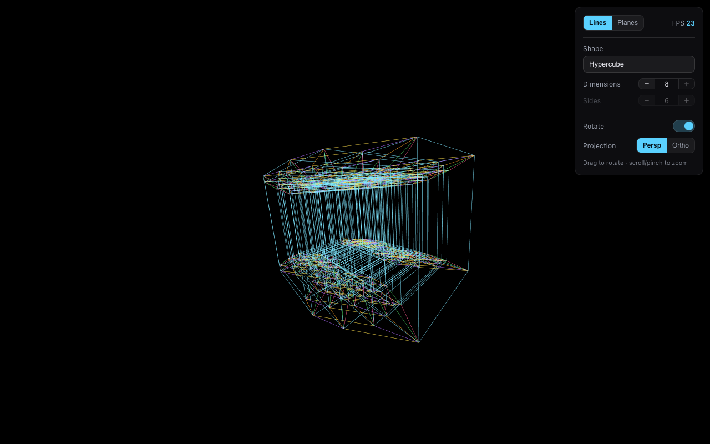

# Multi-Dimensional Shape Visualizer

An interactive visualizer for geometric shapes in **1 to 8 dimensions**,
rendered with Three.js. Watch polytopes, tori, prisms and spheres tumble
through their higher-dimensional rotation planes and project down into 3D —
a hands-on way to build intuition for what "the 4th dimension" (and beyond)
looks like.



## What you need

A modern desktop or tablet browser with WebGL (Chrome, Firefox, Safari,
Edge — including Chromebooks). The app is fully client-side: it collects no
data, needs no account, and a built copy works offline.

## Run it

**Hosted:** the included GitHub Actions workflow publishes the app to GitHub
Pages on every push to `main`. Enable it once in the repository settings
(Settings → Pages → Source: "GitHub Actions") and the app is available at
`https://<your-username>.github.io/multi-dim-viz/` — nothing to install.

**Locally** (requires [Node.js](https://nodejs.org) 20.19 or newer):

```bash
npm install
npm run dev
```

Then open the URL Vite prints (default http://127.0.0.1:5173/).

`npm run build` produces a self-contained static bundle in `dist/` that any
static host can serve, including from a subdirectory. Keep
the included `THIRD-PARTY-NOTICES.txt` with any hosted copy — it carries the
Three.js license notice.

## Controls (top-right panel)

| Control            | What it does                                                                                                                                                                                                                  |
| ------------------ | ----------------------------------------------------------------------------------------------------------------------------------------------------------------------------------------------------------------------------- |
| **Lines / Planes** | View mode toggle.                                                                                                                                                                                                             |
| **FPS**            | Live framerate (render is capped at 60).                                                                                                                                                                                      |
| **Shape**          | Hypercube, Simplex, Cross-Polytope, Torus, Möbius Strip, N-gon Prism, Sphere.                                                                                                                                                 |
| **Dimensions**     | −/+ steppers, range per shape (see below). Updates live.                                                                                                                                                                      |
| **Sides**          | −/+ steppers, range per shape. Disabled when the side count is fixed or not applicable.                                                                                                                                       |
| **Rotate**         | Toggles rigid rotation in ordinary visible space.                                                                                                                                                                             |
| **Shape Change**   | Toggles the higher-dimensional morph: rotations through the hidden axes plus a hidden-depth pulse. Disabled at ≤3 dimensions (nothing hidden to morph); turning it off snaps the shape back to its undeformed, textbook view. |
| **Projection**     | Perspective (nested/telescoping look) ⇄ Orthographic (flat parallel).                                                                                                                                                         |

- **Drag** (mouse or touch) to rotate the view. Dragging manually turns
  Rotate off; a fast fling while Rotate is off hands motion back to
  auto-rotate on release.
- **Scroll / pinch** to zoom.

### Per-shape parameter ranges

Each shape only allows the parameter values where it is geometrically
meaningful; the steppers re-range (and re-clamp) when you switch shapes.

| Shape                                | Dimensions | Sides   | Why                                                                                  |
| ------------------------------------ | ---------- | ------- | ------------------------------------------------------------------------------------ |
| Hypercube / Simplex / Cross-Polytope | 1–8        | —       | meaningful at every dimension, incl. the 1-D segment                                 |
| Torus                                | 2–8        | 2 fixed | 2-D shows the ring; ≥3-D shows the donut surface, coiling into each higher dimension |
| Möbius Strip                         | 3 fixed    | 1 fixed | the one-sided strip needs 3-D for its half-twist                                     |
| N-gon Prism                          | 2–8        | 3–12    | the cross-section polygon needs ≥3 sides                                             |
| Sphere                               | 2–8        | 2 fixed | a 2-sphere surface that coils into each higher dimension (see note below)            |

**A note on the curved shapes:** the torus, sphere and Möbius strip are
2-dimensional _surfaces_. At higher dimension settings the app does not build
a true n-torus or n-sphere (their sampled meshes would be enormous); instead
the familiar surface is coiled into each additional axis with its own winding
harmonic, so every dimension step genuinely changes the shape while staying
fast to render. The polytopes (hypercube, simplex, cross-polytope) and the
prism are exact n-dimensional constructions.

## View modes

- **Lines** — draws the shape's edges. Each edge is colored by the dimension
  it runs most along: dimensions 1–3 share one color (cyan), dimensions 4–8
  each get a distinct vivid hue, so you can read off which dimension an edge
  belongs to. (In code the axes are 0-based: axes 0–2 share the base color.)
- **Planes** — draws the shape's 2-D faces as semi-transparent, double-sided
  lit surfaces, colored the same way as edges (each face takes the color of
  its dominant dimension). A single external light plays across the faces as
  the shape morphs. Lighting an N-D projection is physically hand-wavy — it
  is there to make the structure legible.

## How it works

The pipeline, per frame:

1. **Generate** the shape as N-dimensional vertices / edges / faces
   (`src/geometry/shapes.js`), centered and normalized to a unit radius.
2. **Rotate** the vertices in depth-like coordinate planes — z↔hidden and
   hidden↔hidden — so the extra dimensions are revealed without reading as
   ordinary spin (`src/math/ndmath.js`). Visible-space spin is a separate
   rigid 3D rotation.
3. **Project** N-D → 3D, collapsing one dimension at a time (perspective
   divides by a viewing-distance term at each step; orthographic drops the
   extra coordinates).
4. **Render** the 3D result with Three.js, which projects 3D → 2D for the
   screen.

A rotation in N dimensions happens in a _plane_ (a pair of axes), not around
an axis — that is why the controls talk about rotation planes. Plane speeds
are mutually incommensurate, so the morph never visibly repeats.

## Development

```bash
npm run test     # geometry invariants, closed-form counts, motion logic
npm run bench    # CPU-side rotate/project benchmark for worst-case settings
npm audit        # dependency advisory check
```

Continuous integration (`.github/workflows/ci.yml`) runs the format check,
tests and build on every push, then deploys `dist/` to GitHub Pages from
`main`.

`npm install` sets up a pre-commit hook (via Husky) that runs Prettier and
the test suite. Format with `npx prettier --write .`. After structural
changes (new files, renamed exports), regenerate the repo map with
`python3 scripts/generate-repo-map.py`.

### Project layout

```
src/
  main.js               integration: scene, camera, lights, loop, wiring
  geometry/shapes.js    N-D shape generation (vertices / edges / faces)
  math/ndmath.js        N-D rotation + projection
  math/motion.js        Shape Change morph logic (hidden-depth pulse)
  render/colors.js      dimension -> color mapping
  render/linesRenderer.js   edges as colored line segments
  render/planesRenderer.js  faces as lit translucent surfaces
  ui/panel.js           the top-right control panel
  ui/fps.js             rolling FPS meter
  style.css
tests/
  geometry.test.js      shape invariants, budgets, closed-form math checks
  motion.test.js        morph plane ownership and deformation contracts
scripts/
  bench-geometry.js     CPU-side worst-case rotate/project benchmark
public/
  THIRD-PARTY-NOTICES.txt   ships with the build (Three.js license notice)
```

`.claude/skills/` contains a recipe AI coding agents use to verify changes
end-to-end in a browser; it doubles as a manual QA checklist.

### Geometry and performance caps

The public controls are capped in code (`src/geometry/shapes.js`) and covered
by tests: dimensions max **8**, user-facing sides max **12**, surface
tessellation fixed at **12 segments**, and hard budgets of **≤ 5,000
vertices** / **≤ 20,000 triangles**. `buildShape()` defensively clamps all
inputs into each shape's valid range and throws if a future change exceeds
the budgets. The render loop is capped near 60fps and every setting is
intended to stay comfortably above 30fps on modern desktop hardware.

### Design notes

- **Stable colors.** Edge/face colors are computed once from the un-rotated
  base geometry, so they stay put while the shape spins.
- **Rotation vs. Shape Change.** Visible spin is a rigid 3D rotation of the
  projected object; Shape Change drives only depth-like rotation planes
  (z↔hidden, hidden↔hidden) plus a hidden-depth pulse. Planes touching the
  screen's x or y axes are never auto-driven — they would read as ordinary
  spin.
- **Normalization.** Every shape is centered and uniformly scaled to a ~1
  max radius, so all shapes and dimensions fit the same view without
  distortion.

## More screenshots

See [`docs/screenshots/`](docs/screenshots/) — tesseract (lines & planes),
the round 3D torus, an 8-D coiled torus, the Möbius strip, 8-cube
(perspective & orthographic), 5-simplex, 4-D cross-polytope, octagonal
prism, a sphere, the dimension-colored planes, and the shape dropdown.

## Contributing

Bug reports, ideas and pull requests are welcome — open an issue or PR on
[GitHub](https://github.com/matttennie/multi-dim-viz). Run `npm test` before
submitting (the pre-commit hook runs Prettier and the tests automatically).
Small, focused changes are the easiest to review.

## License

MIT — see [LICENSE](LICENSE). Bundled Three.js is MIT-licensed; its notice
ships with the build in
[`public/THIRD-PARTY-NOTICES.txt`](public/THIRD-PARTY-NOTICES.txt).

Made by [Matt Tennie](https://matthewtennie.com)
([github.com/matttennie](https://github.com/matttennie)).
